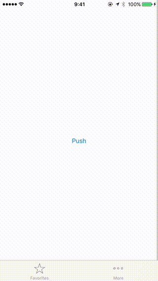

# ContainerInteractiveTransitionExample

Examples of interactive transition of ContainerViewController. (UIPercentDrivenInteractiveTransition)

## Requirements

* Xcode 8.0 (beta 6)
* iOS 9.0+
* Swift 3.0+

## License

MIT license. See the LICENSE file for more info.
